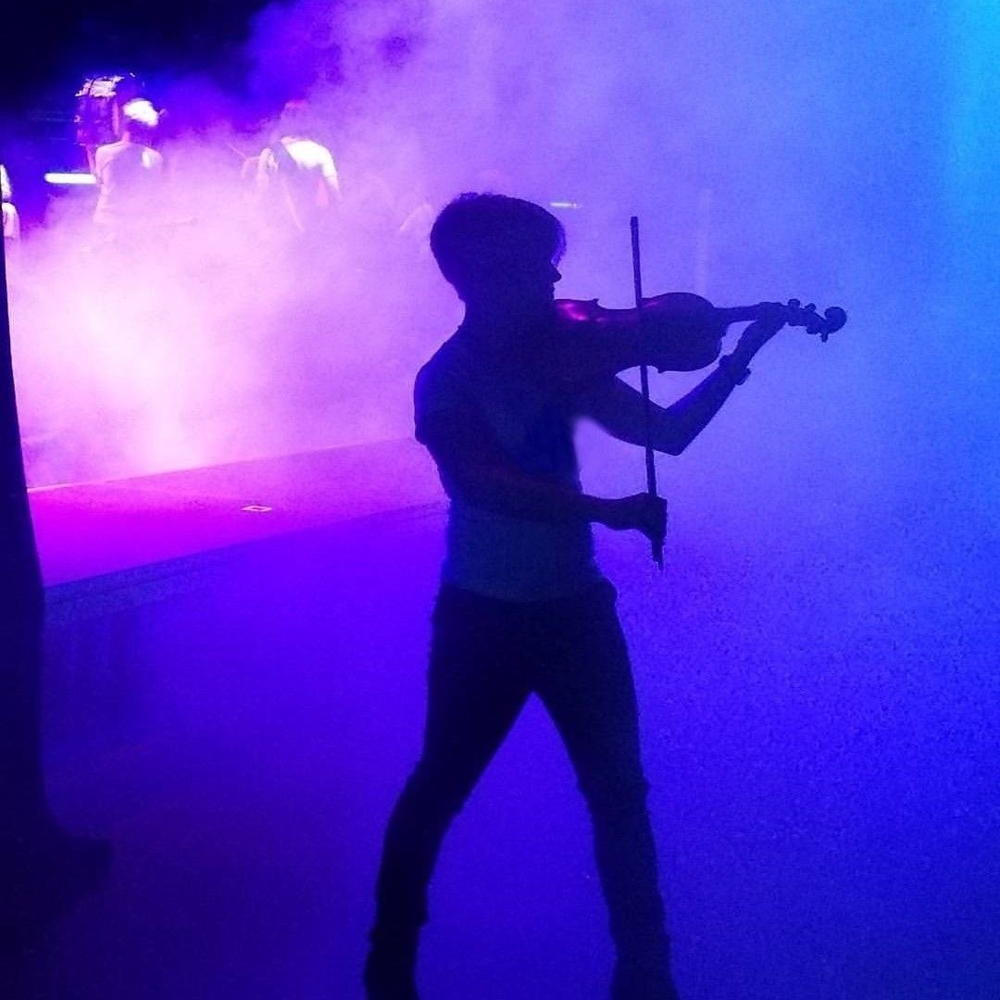

# Gabby
Repositorio
hola
linea 2

### hola esto es un texto h1

__texto en negrita__
_texto en cursiva_
`dir`
```
.container {
    max-width: 90%;
    margin: auto;
}
```


* Lista, item 1
* Lista, item 2
    * item 2.2
        * item 2.2.1

1. Item 1  
  1.1 Item 1.1  
  1.2 Item 1.2  
2. Item 2  

## Tablas

|Titulo 1| Titulo 2 | Titulo 3 | Título 4
| --- |--- | --- | --- 
|fila 1| fila 2 | fila 3 | Fila 4
|fila 1| fila 2 | fila 3 | Fila 4

## Salto de línea
Se hace  
así.

## citas

>Esto es una cita

<!-- Comentario -->



# Seccion
[Enlace a otro documento](markdown.md)